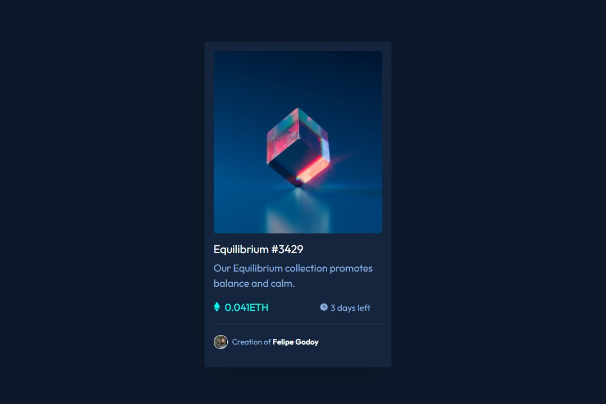
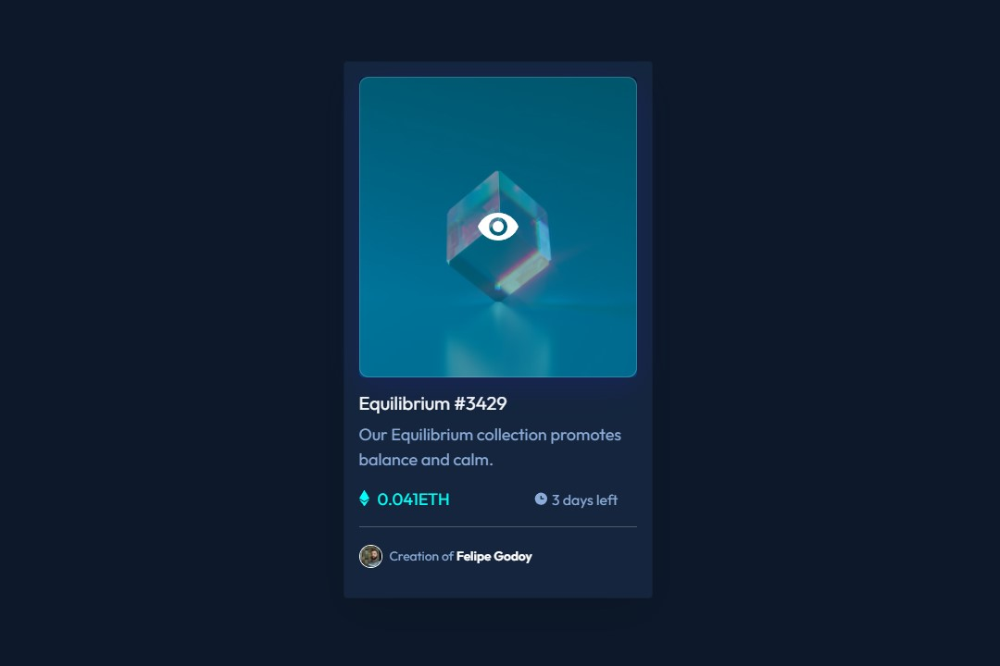

# Frontend Mentor - NFT preview card component solution

Essa é a solução para o desafio [NFT preview card component por Frontend Mentor](https://www.frontendmentor.io/challenges/nft-preview-card-component-SbdUL_w0U).

## Table of contents

- [Visão Geral](#visão-geral)
  - [O Desafio](#o-desafio)
  - [Screenshot](#screenshot)
  - [Links](#links)
- [Meu processo](#meu-processo)
  - [Construído com](#construído-com)
  - [O que eu aprendi](#o-que-eu-aprendi)
  - [Recursos úteis](#recursos-úteis)
- [Autor](#autor)

## Visão Geral

### O Desafio

Construir o projeto para ficar o mais próximo parecido da imagem de pré-visualização do desafio finalizado.

Os usuários devem ser capazes de:

- Visualizar o layout ideal dependendo do tamanho da tela do dispositivo (design responsivo)
- Visualizar o estado de foco para elementos interativos

### Screenshot

### Links

- Projeto: [https://github.com/FelipeGodoy96/NFT-Card-Project](https://github.com/FelipeGodoy96/NFT-Card-Project)
- Live Site URL: [https://felipegodoy96.github.io/NFT-Card-Project](https://felipegodoy96.github.io/NFT-Card-Project)

## Meu processo

### Construído com

- Semântica HTML5
- SCSS
- Bootstrap

### O que eu aprendi

Aprimorei meu conhecimento e prática com o uso de SASS e Bootstrap, combinando o uso de variáveis e classes, respectivamente.

### Recursos úteis

- [Bootstrap 5.1](https://getbootstrap.com/docs/5.1/getting-started/introduction/) - O básico de Bootstrap instalado e suas funcionalidades.
- [SASS](https://sass-lang.com/guide) - Processador de CSS, facilita e muito a criação de stylesheets.

## Autor

- GitHub - [Felipe Godoy](https://github.com/FelipeGodoy96)
- Frontend Mentor - [@FelipeGodoy96](https://www.frontendmentor.io/profile/FelipeGodoy96)
- Instagram - [@Godoy.code](https://www.instagram.com/godoy.code/)

